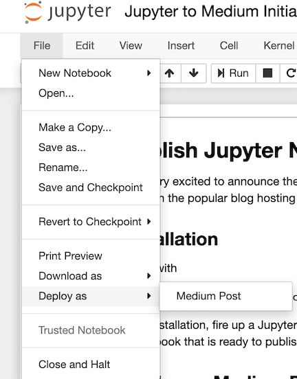
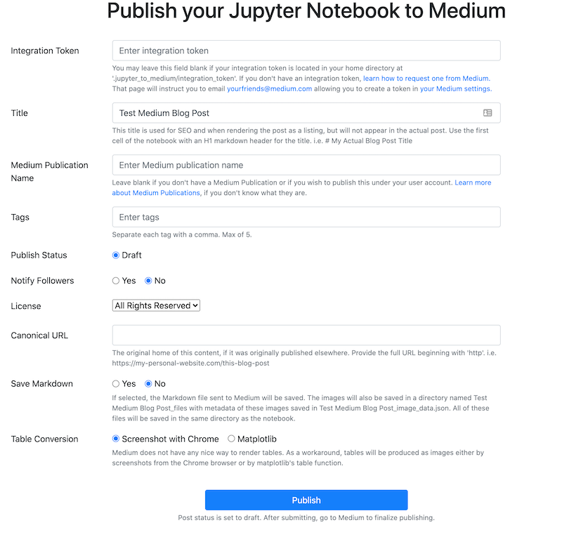

# Jupyter to Medium

Publish Jupyter Notebooks as Medium blog posts directly from your notebook with the help of jupyter_to_medium.

## Installation

`pip install jupyter_to_medium`

Then run the following command to enable the extension.

`jupyter bundlerextension enable --py jupyter_to_medium._bundler --sys-prefix`

## Get an Integration Token from Medium

Before using this package, you must request an integration token from Medium. [Read the instructions here on how to get your integration token](https://github.com/Medium/medium-api-docs).

## Usage

There are three ways to publish notebooks:

* Within an active notebok
* Using a Python script
* From the command line

### Publishing to Medium within a Notebook

After enabling the extension, open the notebook you wish to publish and select the option `File -> Deploy as -> Medium Post`



A new browser tab will open with a short form that needs to be completed.



After clicking publish, the notebook and all images will be uploaded to Medium. Any HTML tables (such as pandas DataFrames) will be converted to images (via chrome) as Medium has no ability to represent tables. This is a time consuming process, so be prepared to wait. Check your terminal for updates on what is happening.

If successful, you'll get the following response with a link to view the post.


Click the link to view the post.


I suggest keeping the setting to publish as a draft, then review on Medium and finalize the publishing there.

### Publishing to Medium with a Python Script

Pass the `publish` function the location of the Jupyter Notebook you would like to publish as a Medium blog post

```python
>>> import jupyter_to_medium as jtm
>>> jtm.publish('My Awesome Jupyter Notebook.ipynb',
                integration_token=None,
                pub_name=None,
                dataframe_image=True,
                title=None,
                tags=None,
                publish_status='draft',
                notify_followers=False,
                license='all-rights-reserved',
                canonical_url=None)
```

If successful, JSON data will be returned with the URL.

### Publishing to Medium from the Command Line (upcoming)

## Dependencies

* Google Chrome / Brave browser