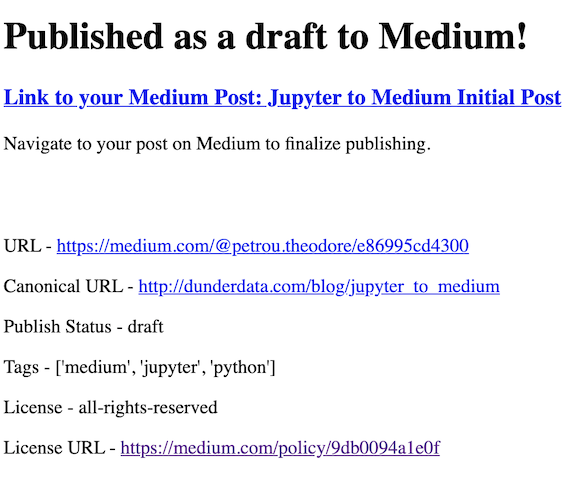

# Jupyter to Medium

Publish Jupyter Notebooks as Medium blog posts directly from your notebook with the help of jupyter_to_medium.

## Installation

`pip install jupyter_to_medium`

### Automatically activated

You should be able to skip the next step, but if the extension is not showing up in your notebook, run the following command:

`jupyter bundlerextension enable --py jupyter_to_medium._bundler --sys-prefix`

## Get an Integration Token from Medium

Before using this package, you must request an integration token from Medium. [Read the instructions here on how to get your integration token](https://github.com/Medium/medium-api-docs).

### Save your integration token

Once you have your integration token, create the folder and file `.jupyter_to_medium/integration_token` in your home directory and save the token there. If you don't save it, you'll need to access it every time you wish to make a new post.

## Usage

There are three ways to publish notebooks:

* Within an active notebook
* Using a Python script
* From the command line

### Publishing to Medium within a Notebook

After installation, open the notebook you wish to publish and select the option `File -> Deploy as -> Medium Post`


A new browser tab will open with a short form that needs to be completed.


After clicking publish, the notebook and all images will be uploaded to Medium. Any HTML tables (such as pandas DataFrames) will be converted to images (via chrome), as Medium has no ability to represent tables. This is a time consuming process, so be prepared to wait. Check your terminal for updates. If successful, you'll get the following response with a link to view the post.



Click the link to view the post.


### Finalize and publish on Medium

As of now, your post will be published as a draft. Review and publish the post on Medium.

### Publishing to Medium with a Python Script

In a separate script/notebook import `juptyer_to_medium` as a module. Pass the `publish` function the location of the Jupyter Notebook you would like to publish as a Medium blog post

```python
>>> import jupyter_to_medium as jtm
>>> jtm.publish('My Awesome Jupyter Notebook.ipynb',
                integration_token=None,
                pub_name=None,
                title=None,
                tags=None,
                publish_status='draft',
                notify_followers=False,
                license='all-rights-reserved',
                canonical_url=None,
                chrome_path=None,
                download_markdown=False)
```

If successful, JSON data will be returned as a dictionary with the URL.

### Publishing to Medium from the Command Line

Upon installation, you'll have access to the command line program `jupyter_to_medium` with the same options as the above function.

```bash
jupyter_to_medium --pub-name="Dunder Data" "My Awesome Blog Post.ipynb"
```

## Dependencies

* nbconvert
* requests
* pillow (if you have HTML tables)
* Google Chrome / Brave browser
