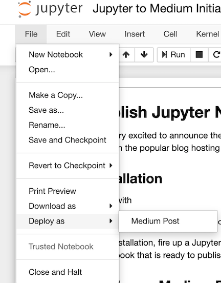
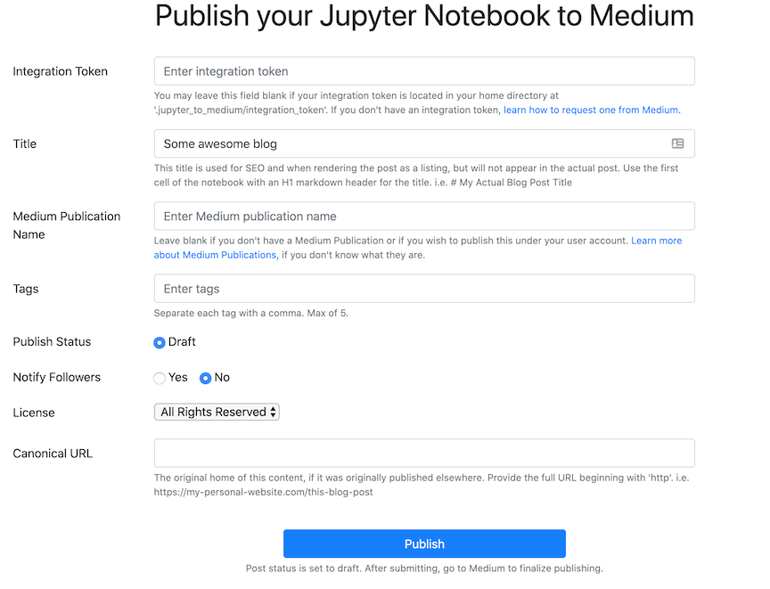
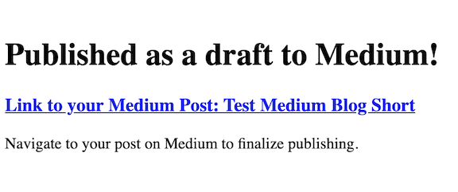
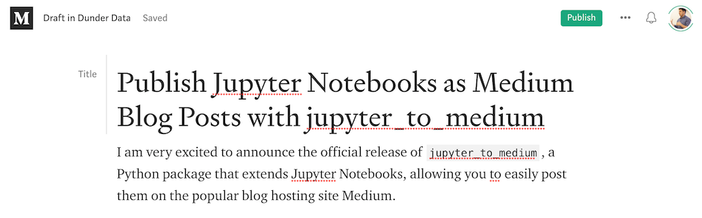

# Jupyter to Medium

[](https://pypi.org/project/jupyter_to_medium)
[](LICENSE)

Publish Jupyter Notebooks as Medium blog posts directly from your notebook with the help of jupyter_to_medium.

## Target User

Do you ....

* Publish blog posts on Medium?
* Use Jupyter Notebooks to write the bulk of your post?
* Dislike the time and effort it takes to transfer your posts from Jupyter to Medium?

If so, jupyter_to_medium will automate the process of taking your Jupyter Notebook as is and publishing it as a Medium post in almost no time at all, saving huge amounts of time.

## Motivation

I've [published dozens of blog posts on Medium][0] myself, all of them beginning as Jupyter Notebooks. Manually converting them to Medium posts was a lengthy, painstaking process. One particularly painful process was inserting tables, which Medium does not support, into my posts. Nearly all of my posts contain numerous pandas DataFrames ([such as this one][1], which has 40! DataFrames) which are represented as HTML tables within a notebook. I'd have to take screenshots of each one to insert them into my Medium posts.

[0]: http://medium.com/dunder-data
[1]: https://medium.com/dunder-data/selecting-subsets-of-data-in-pandas-6fcd0170be9c

## Installation

`pip install jupyter_to_medium`

## Get an Integration Token from Medium

Before using this package, you must request an integration token from Medium. [Read the instructions here on how to get your integration token](https://github.com/Medium/medium-api-docs).

### Save your integration token

Once you have your integration token, create the following folder and file in your home directory.

```
.jupyter_to_medium/integration_token
```

If you don't save it to this file, you'll need to access it every time you make a new post.

## Usage

There are three ways to publish notebooks:

* Within an active notebook
* From the command line
* Using a Python script

### Publishing to Medium within a Notebook

After installation, open the notebook you wish to publish and select the option `File -> Deploy as -> Medium Post`



!!! note
    The extension should be automatically activated in your notebook, but if the above command is not found, run the following from your command line.

    `jupyter bundlerextension enable --py jupyter_to_medium._bundler --sys-prefix`

A new browser tab will open with a short form that needs to be completed.



After clicking publish, the notebook and all images will be uploaded to Medium. Any HTML tables (such as pandas DataFrames) will be converted to images (via chrome), as Medium has no ability to represent tables. This is a time consuming process, so be prepared to wait. Check your terminal for updates. If successful, you'll get the following response with a link to view the post.



Click the link to view the post.



### Finalize and publish on Medium

As of now, your post will be published as a draft. Review and publish the post on Medium.

### Publishing to Medium from the Command Line

Upon installation, you'll have access to the command line program `jupyter_to_medium` with the same options as the above function.

```bash
jupyter_to_medium --pub-name="Dunder Data" --tags="python, data science" "My Awesome Blog Post.ipynb"
```

### Publishing to Medium with a Python Script

In a separate script/notebook, import `juptyer_to_medium` as a module. Pass the `publish` function the location of the Jupyter Notebook you would like to publish as a Medium blog post.

```python
import jupyter_to_medium as jtm
jtm.publish('My Awesome Jupyter Notebook.ipynb',
            integration_token=None,
            pub_name=None,
            title=None,
            tags=None,
            publish_status='draft',
            notify_followers=False,
            license='all-rights-reserved',
            canonical_url=None,
            chrome_path=None,
            download_markdown=False)
```

If successful, a message will be printed with the URL to your post.  Additionally, JSON data will be returned as a dictionary containing the returned request from Medium.

## Troubleshooting

If your post is unsuccessful, a message with the error will be printed to the screen with information that might help you solve the issue.

## Dependencies

* nbconvert
* requests
* pillow (if you have HTML tables)
* Google Chrome / Brave browser
